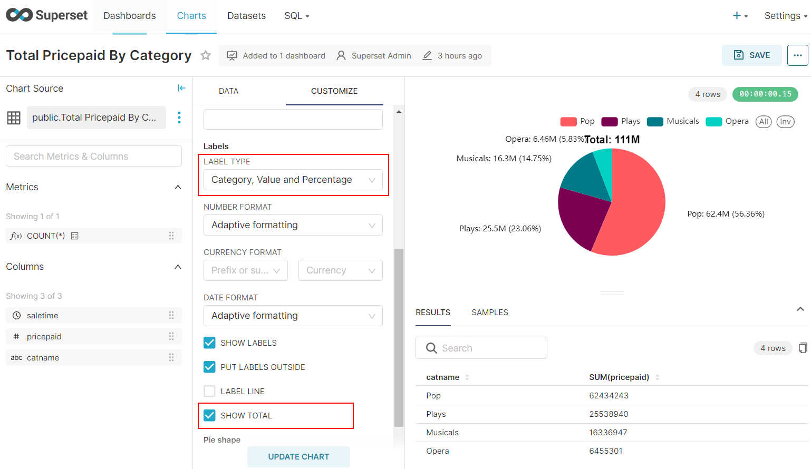
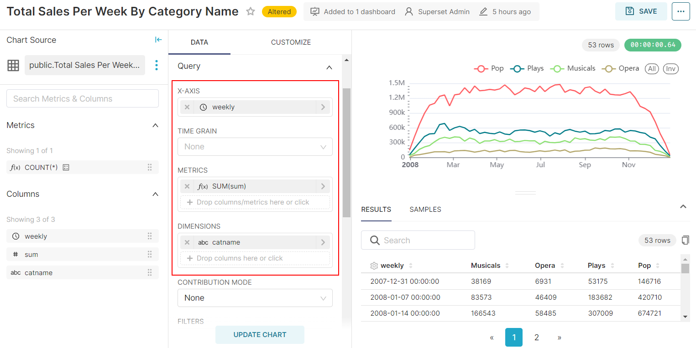

### APACHE SUPERSET 

Apache Superset is a modern, enterprise-ready business intelligence web application. It is fast, lightweight, intuitive,
and loaded with options that make it easy for users of all skill sets to explore and visualize their data, from simple 
pie charts to highly detailed deck.gl geospatial charts.

### Prerequisites

In this example I'll use my Windows OS, I have Docker Desktop and Python3.8 here.

- Create .env file and define your password and key here. 
  - Folder structure:
  ```
  ├── .env
  ├── README.md
  ├── docker-compose.yaml
  └── superset
      └── Dockerfile
  ...
  ```
  - .env file (You can create secret key using "openssl rand -base64 42" in LinuxOS)
  ```
  export POSTGRES_PASSWORD="YOUR_PASSWORD"
  export SUPERSET_SECRET_KEY="YOUR_SECRET_KEY"
  ```
  - Create python venv and install [requirements.txt](./requirements.txt) 

  ```shell
    python3 -m venv superset_venv
  ```
  ```shell
     .\venv\Scripts\activate
  ```
  ```shell
     pip install -r requirements.txt
  ```

### Set-up Superset
- Up the containers

  ```shell
    docker-compose up -d
  ```

- Set up your local admin account

    ```shell
    docker exec -it superset_demo superset fab create-admin \
                  --username admin \
                  --firstname Superset \
                  --lastname Admin \
                  --email admin@superset.com \
                  --password admin
    ```

- Migrate local DB to latest

    ```shell
    docker exec -it superset_demo superset db upgrade
    ```

- Load Examples (Not necessary, You can skip)

    ```shell
    docker exec -it superset_demo superset load_examples
    ```

- Setup roles

    ```shell
    docker exec -it superset_demo superset init
    ```

- Login and take a look -- navigate to http://localhost:8088/login/ -- u/p: [admin/admin]

### Firs look at Superset 

### Set-up Postgresql db

- Connect db as root and create a user

  ```shell
  docker exec -it psql bash
  ```
  ```shell
  psql -U postgres
  ```
  ```
  CREATE USER prod WITH PASSWORD 'prod';
  CREATE DATABASE prod;
  GRANT ALL PRIVILEGES ON DATABASE prod TO prod;
  ALTER DATABASE prod OWNER TO prod;
  GRANT USAGE, CREATE ON SCHEMA public TO prod;
  ```
- Exit from root user (ctrl+D) and connect prod database with prod user
  ```shell
  psql -U prod -d prod
  ```
- Create tables using create_table.md

### Upload data to db
- Run Jupyterlab 
  ```shell
  jupyter lab --ip 0.0.0.0 --port 8888
  ```
- Load files to postgresql using explore_tickit.ipynb (Don't forget to change your file_path)

### Create DB connection

 


### Create Datasets
- Create datasets for all tables in postgresql following the steps below.


**NOTE**:
If you get error when creating users datasets, there may be another users dataset (if you loaded examples when setting up superset). 
Delete this dataset so that you can create new one.

### Create Dashboard


- Rename it and click create new chart


### Create Charts
- Create bar chart for "Event Count By Category"
 ```commandline
select 
    event.eventid,
    event.catid,
    event.venueid,
    event.dateid,
    event.starttime,
    event.eventname,
category.catname from event 
left join category on event.catid=category.catid;
```


- Create pie chart for "Total Pricepaid By Category" (no screenshots of repeating steps were taken).
```commandline
select 
    sales.saletime,
    sales.pricepaid,
    category.catname from sales
left join event on sales.eventid=event.eventid 
left join category on event.catid=category.catid;
```



- Create line chart for "Total Sales Per Month"


- Create line chart for "Total Sales Per Day" and "Total Sales Per Week" only changing "time grain" in previous step.

- Create line chart for "Total Sales Per Week By Category Name" 

```commandline
    select 
        date_trunc('week', sales.saletime::date) AS weekly,
        sum(sales.pricepaid),category.catname 
    from sales
    left join event on sales.eventid=event.eventid 
    left join category on event.catid=category.catid
    group by weekly,category.catname
    order by weekly;
```



- Create bar chart for "Sum Of Current Tickets and Sold Tickets"

```commandline
    select 
        sum(qtysold) as sold,
        numtickets,
        event.eventid,
        category.catid,
        category.catname,
        catgroup 
    from sales
    left join listing on sales.listid=listing.listid
    left join event on sales.eventid=event.eventid
    left join category on event.catid=category.catid
    group by numtickets,event.eventid,category.catid,category.catname,catgroup
    order by event.eventid;
```

