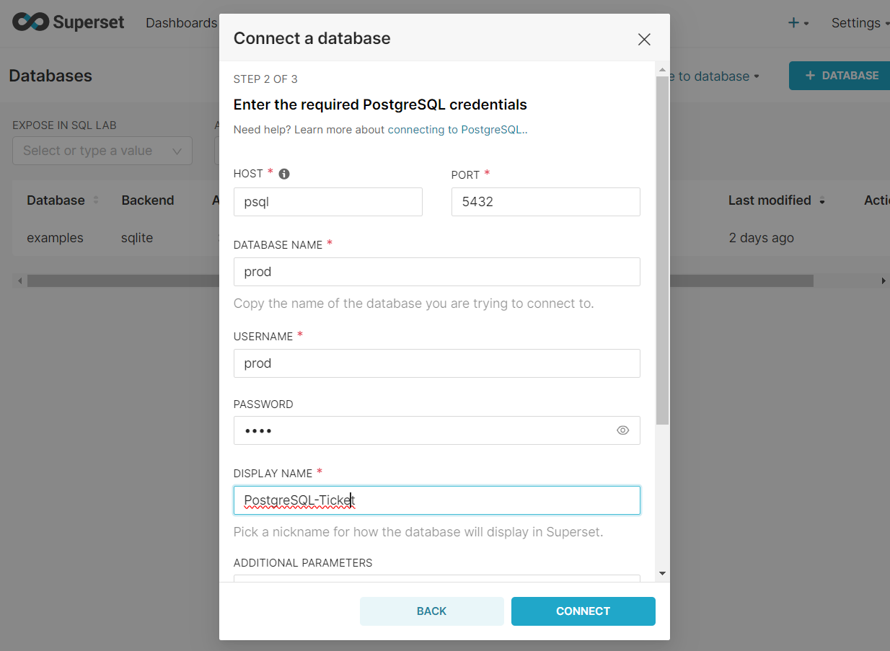
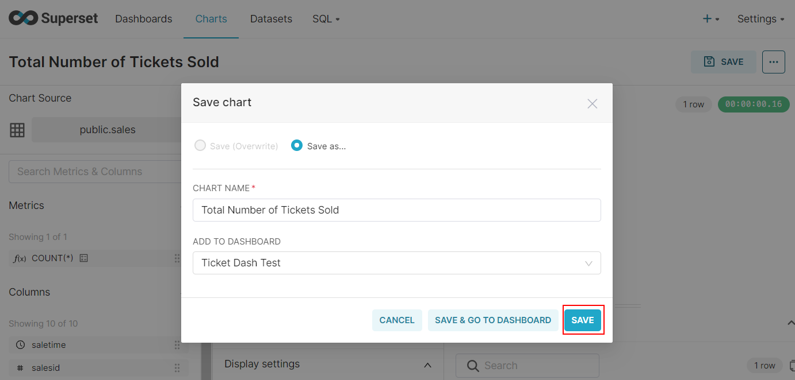
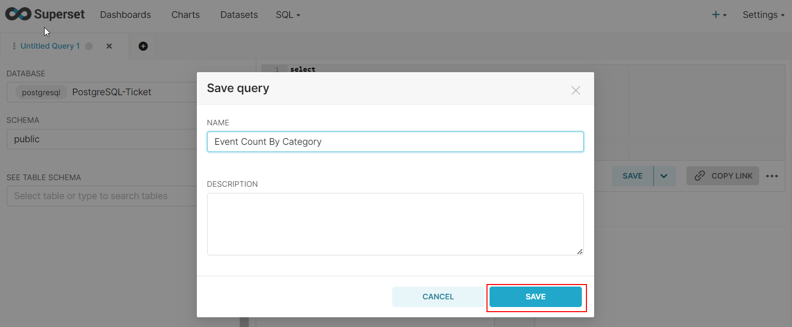
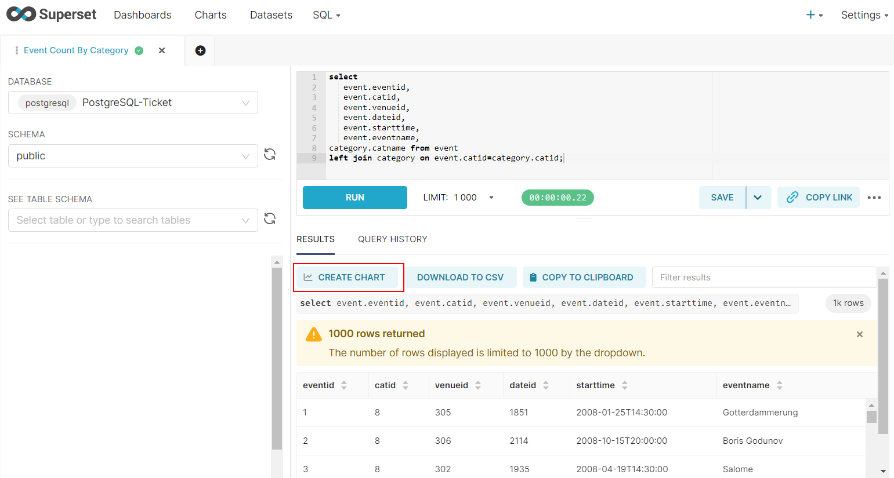
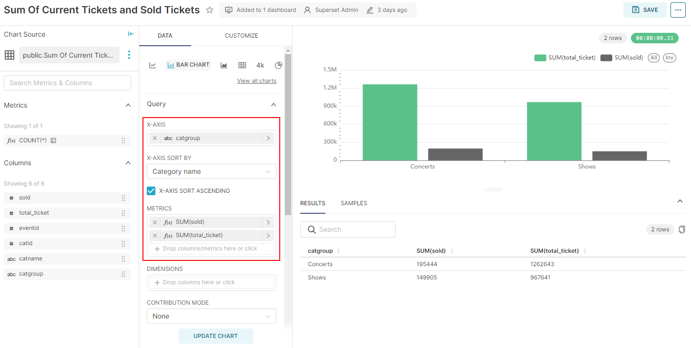

### APACHE SUPERSET 

Apache Superset is a modern, enterprise-ready business intelligence web application. It is fast, lightweight, intuitive,
and loaded with options that make it easy for users of all skill sets to explore and visualize their data, from simple 
pie charts to highly detailed deck.gl geospatial charts.

### Prerequisites

In this example I'll use my Windows OS, I have Docker Desktop and Python3.8 here.
You can follow with LinuxOS as well. 
### Set-up 

- Create .env file and define your password and key here. 
  - Initial folder structure:
  ```
  ├── .env
  ├── README.md
  ├── docker-compose.yaml
  └── superset
      └── Dockerfile
  ```
  - .env file (You can create secret key using "openssl rand -base64 42" in LinuxOS)
  ```
  export POSTGRES_PASSWORD="YOUR_PASSWORD"
  export SUPERSET_SECRET_KEY="YOUR_SECRET_KEY"
  ```

- Up the containers

  ```shell
    docker-compose up -d
  ```

- Set up your local admin account

    ```shell
    docker exec -it superset_demo superset fab create-admin \
                  --username admin \
                  --firstname Superset \
                  --lastname Admin \
                  --email admin@superset.com \
                  --password admin
    ```

- Migrate local DB to latest

    ```shell
    docker exec -it superset_demo superset db upgrade
    ```

- Load Examples (Not necessary, You can skip)

    ```shell
    docker exec -it superset_demo superset load_examples
    ```

- Setup roles

    ```shell
    docker exec -it superset_demo superset init
    ```

- Login and take a look -- navigate to http://localhost:8088/login/ -- u/p: [admin/admin]

### Firs look at Superset 

### Set-up Postgresql db

- Create python venv and install [requirements](./requirements.txt) 

  ```shell
    python3 -m venv superset_venv
  ```
  - For Windows
  ```shell
     .\venv\Scripts\activate
  ```
  - For Linux
  ```shell
     source superset_venv/bin/activate
  ```
  - Install requirements
  ```shell
     pip install -r requirements.txt
  ```

- Connect db as root and create a user

  ```shell
  docker exec -it psql bash
  ```
  ```shell
  psql -U postgres
  ```
  ```
  CREATE USER prod WITH PASSWORD 'prod';
  CREATE DATABASE prod;
  GRANT ALL PRIVILEGES ON DATABASE prod TO prod;
  ALTER DATABASE prod OWNER TO prod;
  GRANT USAGE, CREATE ON SCHEMA public TO prod;
  ```
- Exit from root user (ctrl+D) and connect prod database with prod user
  ```shell
  psql -U prod -d prod
  ```
- Create tables using create_table.md (or you can define your schema in explore_ticket.ipynb file)

### Upload data to db
- Run Jupyterlab 
  ```shell
  jupyter lab --ip 0.0.0.0 --port 8888
  ```
- Load files to postgresql using explore_tickit.ipynb (Don't forget to change your file_path)

### Create DB connection

- Follow the steps below to create db connection

   
  
  
  
  

### Create Datasets

- Create datasets for "sales" table in postgresql following the steps below.

  
  
  
  

- You can add more by clicking "Add a dataset". But for this example we won't add.
  

**NOTE**:
If you get error when creating users datasets, there may be another users dataset (if you loaded examples when setting up superset). 
Delete this dataset so that you can create new one.

### Create Dashboard

- Click Dashboard, rename it and click create new chart


- Go to main page 

### Create Charts (without join)

**NOTE**: No screenshots of repeating steps were taken.

#### Desired output 

- We will create the charts on the dashboard below

  

#### Total Number of Tickets Sold
- Create Big Number chart

  
  
  
  
  
  

- Click "CREATE CHART", then name your chart and click "SAVE"

  

#### Total Pricepaid

- Similar to chart we created previous step, you will only choose 
"pricepaid" column.

#### Total Sales Per Month

- Create line chart

  


### Create Charts (with join)

#### Event Count By Category

- Create bar chart
   ```commandline
  select 
      event.eventid,
      event.catid,
      event.venueid,
      event.dateid,
      event.starttime,
      event.eventname,
  category.catname from event 
  left join category on event.catid=category.catid;
  ```
  
  
  
  
  

#### Total Pricepaid By Category 
- Create pie chart
  ```commandline
  select 
      sales.saletime,
      sales.pricepaid,
      category.catname from sales
  left join event on sales.eventid=event.eventid 
  left join category on event.catid=category.catid;
  ```
  
  

#### Total Sales Per Week By Category Name

- Create line chart with dimension
  ```commandline
  select 
      date_trunc('week', sales.saletime::date) AS weekly,
      sum(sales.pricepaid),category.catname 
  from sales
  left join event on sales.eventid=event.eventid 
  left join category on event.catid=category.catid
  group by weekly,category.catname
  order by weekly;
  ```
  


#### Sum Of Current Tickets and Sold Tickets
- Create bar chart 
  ```commandline
  select 
      sum(qtysold) as sold,
      sum(numtickets) as numtickets,
      event.eventid,
      category.catid,
      category.catname,
      catgroup 
  from listing
  left join sales on sales.listid=listing.listid
  left join event on sales.eventid=event.eventid
  left join category on event.catid=category.catid
  group by event.eventid,category.catid,category.catname,catgroup
  order by event.eventid;
  ```
  

#### Set auto refresh
- In our example our datasets doesn't change, but if you need to refresh table you set auto refresh.


#### Manage access to Dashboards
- You can control which role will be able to see the dashboard. Take a look to [this page](https://superset.apache.org/docs/creating-charts-dashboards/creating-your-first-dashboard/#manage-access-to-dashboards).
